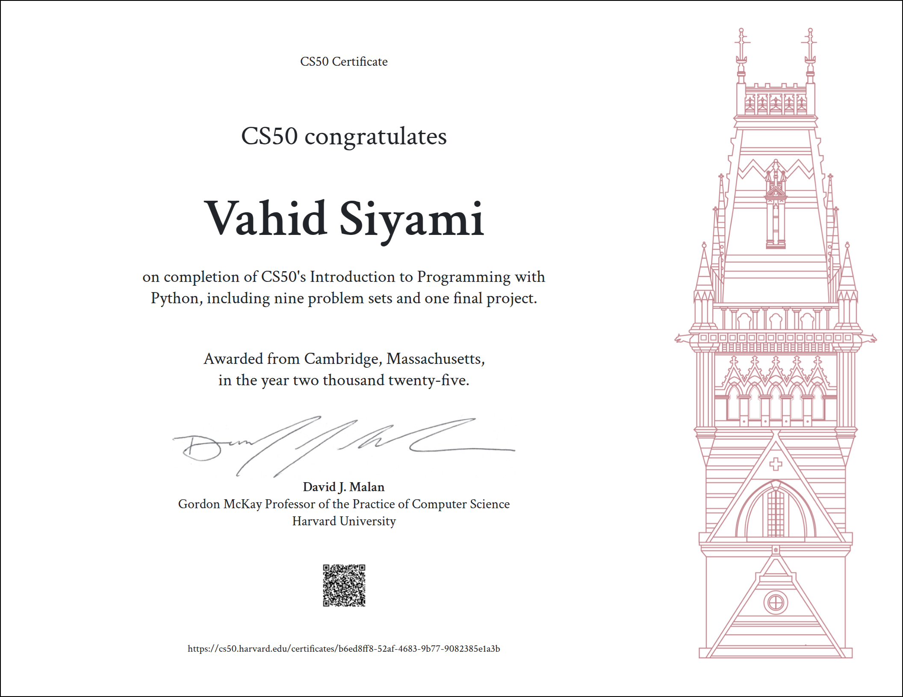

# CS50P Solutions Archive

This repository contains an archive of solutions to the problem sets from CS50P: Introduction to Programming with Python. The course, offered by Harvard University, covers fundamental programming concepts in Python.

## Course Information
The **CS50P** course (Harvard's Introduction to Programming with Python) covers fundamental programming concepts and introduces Python, one of the most popular programming languages in the world. This project demonstrates the skills learned throughout the course, including working with APIs, handling user input, and interacting with the system. For more information about CS50P, visit [CS50P on edX](https://www.edx.org/course/cs50s-introduction-to-programming-with-python).

## License
This project is open-source and available under the [MIT License](LICENSE).

## Certification
Here is a proof of my completion of the CS50P course:

