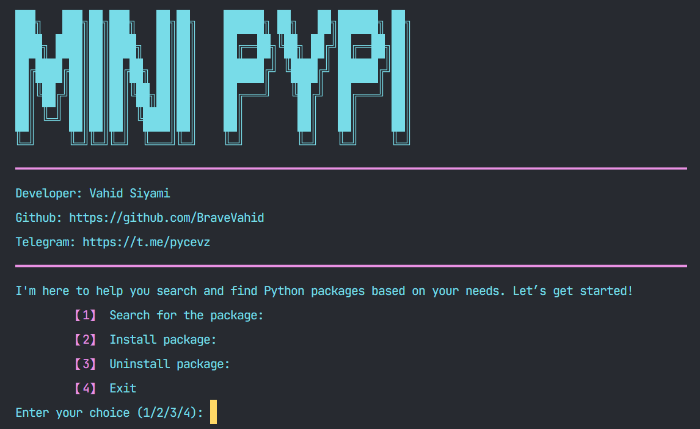

# MINI PYPI

A Python program to search, install, and uninstall Python packages using pip. It interacts with the user through a terminal interface and provides useful package information fetched from PyPI.

## Table of Contents

1. [About the Project](#about-the-project)
2. [Features](#features)
3. [Installation](#installation)
4. [Usage](#usage)
5. [Screenshot](#Screenshot)
6. [Contact](#contact)
7. [Course Information](#course-information)

## About the Project

This project is a **final project** for the **CS50P** course (Harvard's Introduction to Programming with Python). The project is a simple Python program that allows users to search for packages, install, and uninstall them from their Python environment. It interacts with the user in a terminal interface, using the `requests` library to fetch package data from PyPI, and the `subprocess` module to manage package installation and uninstallation. The program provides a simple menu for users to choose an action.

The purpose of this project was to apply the fundamental programming concepts learned in the course while working with APIs and managing user input and system interaction.

## Features

- Search for a Python package on PyPI and view its details.
- Install a Python package using pip.
- Uninstall an existing Python package.
- Interactive terminal-based user interface.
- Handle errors and provide retry options if something goes wrong.

## Installation

To install and run the program, follow the steps below:

1. Clone the repository:

```bash
git clone https://github.com/BraveVahid/repository.git
cd repository
```

2. Install required dependencies:

```bash
pip install -r requirements.txt
```

3. Run the program:

```bash
python main.py
```

The program will display a menu for you to choose between searching, installing, or uninstalling a package.

## Usage

Once you run the program, you will see a menu with the following options:

1. **Search for a package**: Enter the package name to retrieve detailed information, including the version, description, and author.
2. **Install a package**: Enter the name of the package you want to install, and the program will install it via pip.
3. **Uninstall a package**: Enter the name of the package you want to uninstall, and the program will uninstall it using pip.
4. **Exit**: Exit the program.

## Screenshot



## Contact

If you have any questions or need further assistance, feel free to contact the developer:

- **GitHub**: [https://github.com/bravevahid](https://github.com/bravevahid)
- **Email**: vahidsiyami.dev@gmail.com
- **Telegram**: [https://t.me/pycevz](https://t.me/pycevz)

## Course Information

This project was created as the **final project** for the **CS50P** course (Harvard's Introduction to Programming with Python). The course covers fundamental programming concepts and introduces Python, one of the most popular programming languages in the world. This project demonstrates the skills learned throughout the course, including working with APIs, handling user input, and interacting with the system.

For more information about CS50P, visit [CS50P on edX](https://www.edx.org/course/cs50s-introduction-to-programming-with-python).
